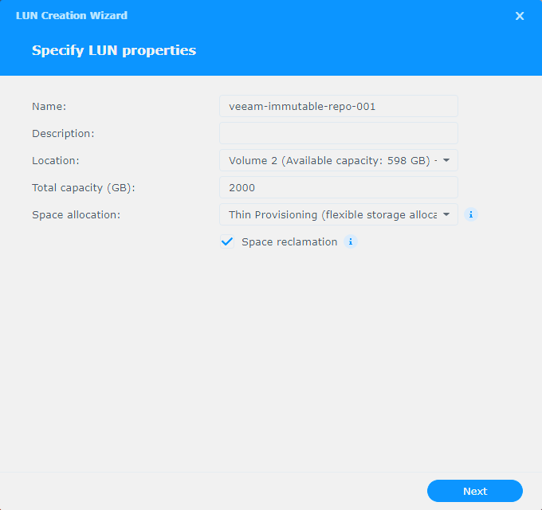
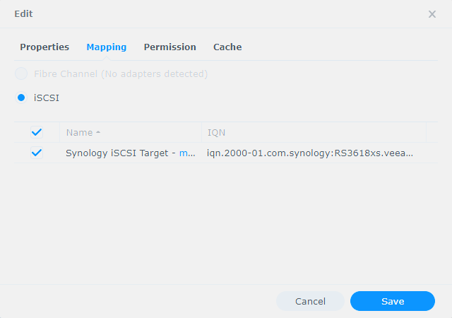
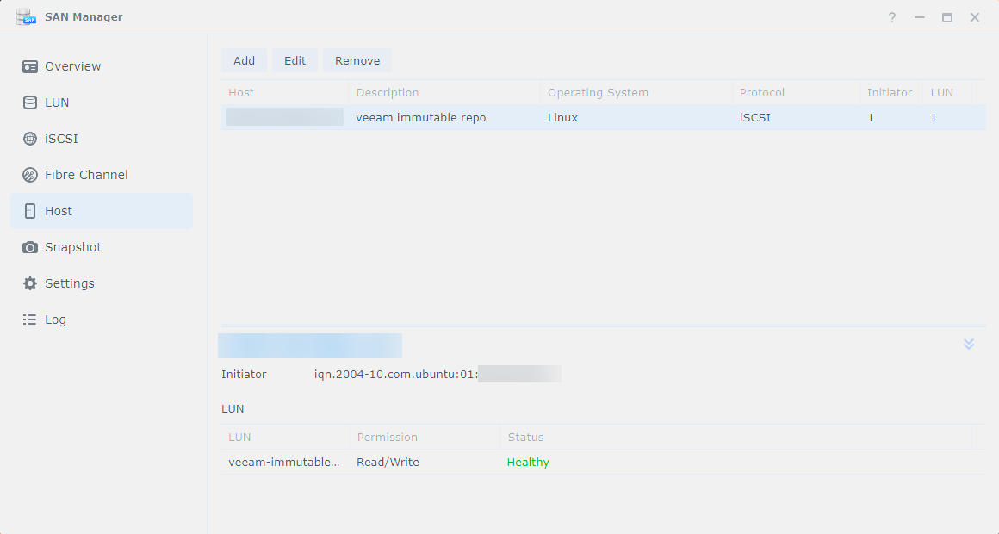
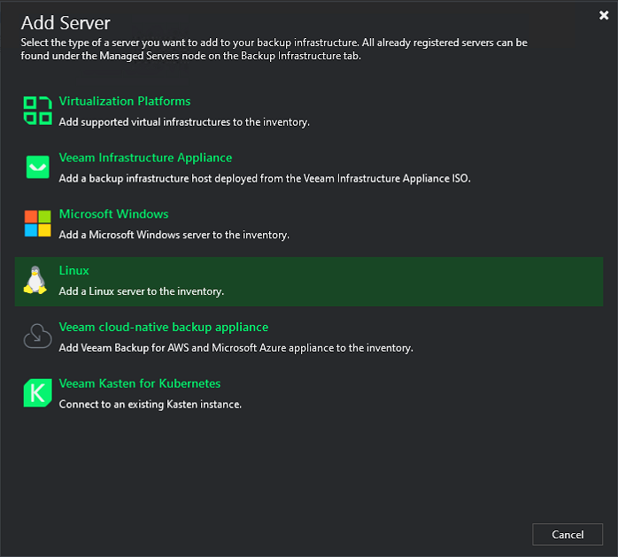
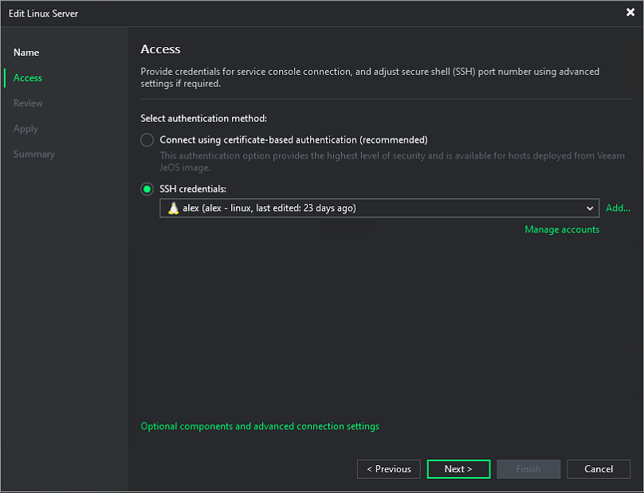
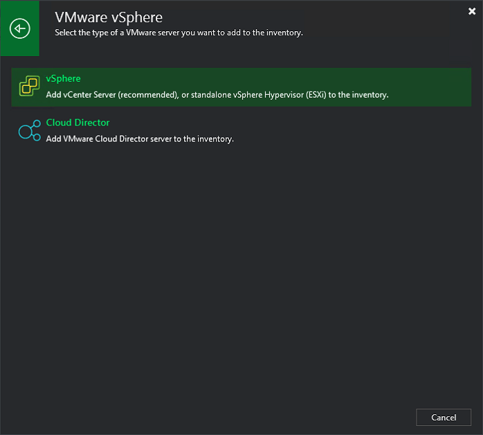
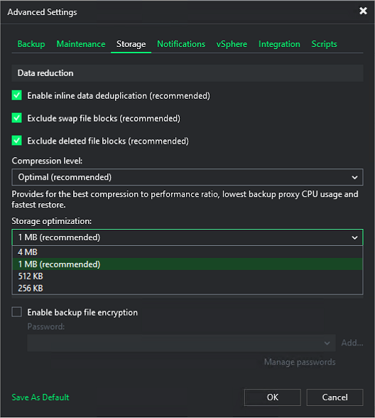
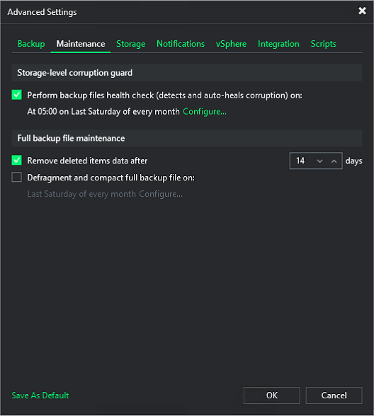
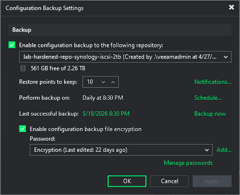
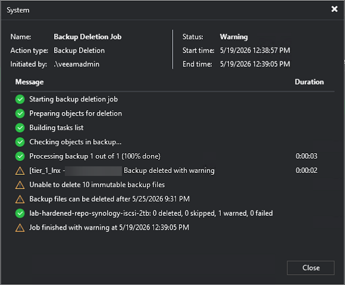

{
  "title": "Veeam Backup & Replication 13 - Hardened Immutable Home Lab",
  "date": "2026-05-19T12:00:00-04:00",
  "lastmod": "2026-05-19T12:00:00-04:00",
  "slug": "veeam-13-hardened-immutable-home-lab",
  "url": "/posts/veeam-13-hardened-immutable-home-lab/",
  "draft": false,
  "description": "A walkthrough of my hardened, immutable Veeam Backup & Replication 13 home lab build with a Synology iSCSI LUN, a Linux hardened repo VM, XFS reflink, and tag-driven backup jobs.",
  "featured_image": "veeam-homelab.png",
  "categories": [
    "Home Lab",
    "How-To's"
  ],
  "tags": [
    "Veeam",
    "homelab",
    "How-To's",
    "Backup",
    "VMware",
    "vSphere",
    "Synology",
    "Linux",
    "iSCSI"
  ],
  "years": [
    "2026"
  ],
  "aliases": [],
  "comments": []
}

It's been a minute since my last home lab post, but I've been heads-down on something I'm genuinely excited to share.  With the release of [Veeam Backup & Replication 13](https://www.veeam.com/products/veeam-data-platform.html) (VBR 13 for short), I took the opportunity to rebuild the backup setup in my home lab from the ground up and stand up a proper hardened, immutable repository for my VMware workloads.

This post walks through the exact build I landed on, including the design tradeoffs along the way, the commands I ran, and a few pitfalls I hit so you don't have to.  Let's get to it!

## What we're building

At a high level, the architecture looks like this:

```
VMware lab VMs
   |
   v
Veeam Software Appliance (vbr.lab.example.com, VBR 13.0.1.2067)
   |
   v
Linux Hardened Repository VM (vbhr.lab.example.com, Ubuntu 24.04)
   |
   v  iSCSI / CHAP
   v
Synology RS3618xs - 2 TB LUN
   |
   v  XFS reflink + Veeam immutability
```

The Veeam Software Appliance handles orchestration, but the actual backup data lands on a separate Ubuntu 24.04 VM that serves as the hardened Linux repository.  That VM connects to a dedicated 2 TB iSCSI LUN on my Synology RS3618xs, formatted as XFS with reflink enabled so Veeam can do fast cloning for synthetic fulls.

Physical machines are intentionally out of scope for this build.  I cover those with [Synology Active Backup for Business](https://www.synology.com/en-us/dsm/feature/active_backup_business) on a separate, larger volume, which keeps the Veeam repo focused on virtual workloads and preserves capacity for what really matters.

A quick word on **why I'm running a separate repo VM** instead of pointing Veeam straight at the appliance itself.  Keeping the repository on its own VM contains the blast radius.  If the VBR appliance ever gets compromised or lost, the immutable repo is still its own isolated system with its own credentials and its own filesystem-level protections, and that's a hill worth dying on for a backup design.

## Prerequisites

A few things before we start:

- **Veeam Software Appliance** deployed and licensed.  Build **must be 13.0.1.2067 or later** (earlier 13.0.1.x builds have an authenticated-domain-user RCE per the March 2026 advisory).
- **Synology** with available capacity, DSM 7.2+, and SAN Manager.
- **vCenter 8.0+** with admin access.  My SSO domain is a custom one (`lab.example.local`).
- **Active Directory** (`lab.example.com`) with a domain admin or Backup Operators account for guest application-aware processing.
- **One fresh Ubuntu 24.04 LTS VM** to serve as the hardened repo (separate from the VBR appliance, as discussed above).

<aside class="info-block"><p>A quick note on the screenshots throughout this guide: they reflect specific names, hostnames, and IDs from my lab, which may differ from the placeholder values used in the walkthrough text (e.g. <code>vbhr.lab.example.com</code>, IQNs, etc.).  Focus on the UI flow and option labels, then adapt the values to fit your own environment.</p></aside>

## Phase 1 - Synology iSCSI LUN

In **DSM → SAN Manager**:

1. **LUN** → Create a **thin-provisioned** LUN named `veeam-immutable-repo-01`, size 2 TB, on a healthy volume.  Thin gets you Synology-side snapshot support and `UNMAP`/space reclamation, both of which thick LUNs do not support.

   

   <aside class="info-block"><p>2 TB is what I had spare in my lab.  For a production-flavored build, size your LUN for at least your full retention window plus headroom: roughly <em>(daily change rate × retention days) + (one full backup) + 30% slack</em>.  At 7-day immutability with synthetic fulls, 2 TB covers a modest VMware footprint but leaves no room to grow retention or add jobs.</p></aside>
2. **iSCSI** → Create a target named `veeam-target` with:
   - **Enable CHAP**
   - CHAP user: `veeamiscsi`
   - CHAP password: long random; store in 1Password (or your password manager of choice)
3. **LUN** → select `veeam-immutable-repo-01` → **Edit** → **Mapping** tab → select **iSCSI** and tick the `veeam-target` row to map the LUN to the target.  (You can also do this from the iSCSI side: **iSCSI → Edit → Mapping** tab shows the same relationship.)

   
4. Note the target IQN.  Mine looks like this (yours will differ):

   ```
   iqn.2000-01.com.synology:RS3618xs.veeam-target.9c4a17e2b30
   ```

<aside class="info-block"><p>DSM 7.2.2+ removed per-target initiator masking, so we'll use <strong>Host-level masking</strong> instead in Phase 4 below.</p></aside>

## Phase 2 - Hardened repo VM

Deploy a fresh Ubuntu 24.04 LTS VM in vSphere with the following:

| Setting | Value |
|---|---|
| Name | `vbhr` (DNS alias `veeam-repo01` optional) |
| vCPU / RAM | 4 / 8 GiB |
| OS disk | 60 GiB thin |
| Data disk | **None** (the iSCSI LUN is the data volume) |
| NIC | VMXNET3, management VLAN |
| Firmware | EFI, **Secure Boot disabled** |
| Domain join | **Do not join** - keep it isolated |

In the installer:

- Hostname: `vbhr`
- Local admin: your usual personal account (e.g. `alex`).  **Not** the Veeam repo user yet, we'll create that later.
- Install OpenSSH server: yes
- Storage layout: LVM default

After first boot, get the box patched and install the bits we need:

```bash
sudo apt update && sudo apt -y full-upgrade
sudo apt install -y open-vm-tools open-iscsi xfsprogs ufw chrony curl vim openssh-server
sudo systemctl enable --now iscsid open-iscsi chrony ssh
chronyc tracking
```

Then capture the initiator IQN, which we'll need in Phase 4:

```bash
sudo cat /etc/iscsi/initiatorname.iscsi
```

Example value (yours will be unique):

```
InitiatorName=iqn.2004-10.com.ubuntu:01:7b3e02f4a18
```

## Phase 3 - Grow the OS volume

Ubuntu's default auto-layout under-allocates `/`, so let's fix that up front:

```bash
sudo growpart /dev/sda 3
sudo pvresize /dev/sda3
sudo lvextend -l +100%FREE /dev/ubuntu-vg/ubuntu-lv
sudo resize2fs /dev/ubuntu-vg/ubuntu-lv
df -hT /
```

Result: `/` grows from ~11 GiB to ~57 GiB on a 60 GiB OS disk.  Online, no reboot.

## Phase 4 - Synology host-level masking

This is the replacement for per-target initiator ACLs in DSM 7.2.2+.

In **DSM → SAN Manager → Host**:

1. **Add** → name `vbhr.lab.example.com`, Operating System = **Linux**.  (Protocol may be exposed or implicit depending on your model and licensing.)
2. **Add Initiator** manually with the initiator IQN captured in Phase 2.
3. Save.

Then in **SAN Manager → LUN → veeam-immutable-repo-01 → Edit → Permission**:

- Permission mode: **Custom**
- Add `vbhr.lab.example.com` with **Read/Write**
- Save.



<aside class="info-block"><p>Any unlisted host is now denied at the SCSI layer.</p></aside>

## Phase 5 - Connect Ubuntu to the LUN

Set up the iSCSI session, pointing at the Synology portal and using the CHAP creds from Phase 1:

```bash
TARGET=iqn.2000-01.com.synology:RS3618xs.veeam-target.9c4a17e2b30
PORTAL=<SYNOLOGY_IP>:3260
CHAP_USER=veeamiscsi
CHAP_PASS='REPLACE_WITH_CHAP_PASSWORD'

sudo iscsiadm -m discovery -t sendtargets -p <SYNOLOGY_IP>

sudo iscsiadm -m node -T $TARGET -p $PORTAL --op=update -n node.session.auth.authmethod -v CHAP
sudo iscsiadm -m node -T $TARGET -p $PORTAL --op=update -n node.session.auth.username   -v $CHAP_USER
sudo iscsiadm -m node -T $TARGET -p $PORTAL --op=update -n node.session.auth.password   -v "$CHAP_PASS"

sudo iscsiadm -m node -T $TARGET -p $PORTAL --login
sudo iscsiadm -m node -T $TARGET -p $PORTAL --op=update -n node.startup -v automatic

# Verify the LUN appears, e.g. /dev/sdb at 2.3 TB
lsblk
sudo iscsiadm -m session
```

### Pin the initiator IQN

Here's a fun one I hit the hard way.  The `open-iscsi` package's postinst will sometimes regenerate `/etc/iscsi/initiatorname.iscsi` on apt upgrades, which immediately breaks Synology host masking and triggers an XFS shutdown on the repo VM the next time iSCSI tries to log in.  Asked me how I know...lol.

The fix is to lock the file with the immutable attribute so it can't be silently rewritten:

```bash
sudo chattr +i /etc/iscsi/initiatorname.iscsi
sudo lsattr /etc/iscsi/initiatorname.iscsi    # expect: ----i---------e-------
```

<aside class="info-block"><p>When you intentionally want to change the initiator IQN later, run <code>sudo chattr -i /etc/iscsi/initiatorname.iscsi</code> first to remove the immutable flag.</p></aside>

## Phase 6 - Format XFS with reflink

We'll use the whole device with no partition table.  Cleaner resize semantics and one less thing to manage.

```bash
sudo mkfs.xfs -f -m reflink=1,crc=1 -L veeam-repo01 /dev/sdb
sudo blkid /dev/sdb
sudo mkdir -p /veeam/repo01
```

Add the following to `/etc/fstab`, replacing `<UUID>` with the value `blkid` gave you:

```
UUID=<UUID>  /veeam/repo01  xfs  defaults,noatime,_netdev,x-systemd.requires=iscsi.service,nofail  0 0
```

<aside class="info-block"><p>The <code>_netdev</code> and <code>x-systemd.requires=iscsi.service</code> options are not optional.  Without them, <code>mount -a</code> runs before iSCSI is logged in at boot and you'll have a bad time.</p></aside>

```bash
sudo systemctl daemon-reload
sudo mount -a
df -hT /veeam/repo01
xfs_info /veeam/repo01 | grep -E 'reflink|crc'   # both must be =1

# Reboot test - confirm /veeam/repo01 mounts automatically
sudo reboot
```

## Phase 7 - Veeam repo user

```bash
sudo useradd -m -s /bin/bash veeamrepo
sudo passwd veeamrepo                # save in 1Password
sudo usermod -aG sudo veeamrepo      # temporary, only needed during Veeam deploy

sudo chown root:root /veeam
sudo chmod 755 /veeam
sudo mkdir -p /veeam/repo01/backups
sudo chown veeamrepo:veeamrepo /veeam/repo01/backups
sudo chmod 700 /veeam/repo01/backups
```

<aside class="info-block"><p>The sudo grant above is temporary.  We'll strip it back off at the end of Phase 8, once the repo is registered in Veeam.</p></aside>

## Phase 8 - Add the hardened repository in Veeam

Quick heads-up before we dive in.  Several admin features in VBR 13 still live in the **legacy Windows console** rather than the new web console.  Hardened repository creation is available in both, but **configuration backup** and **scale-out backup repository (SOBR) creation** are still Windows-console only in v13 GA, so we'll do this whole walkthrough from the Windows console for consistency.  Download the console MSI from the appliance landing page (`https://vbr.lab.example.com/`), install it on a Windows host, then connect to `vbr.lab.example.com:9392`.

In v13, this is a two-step flow: first we add `vbhr` as a managed Linux server, then we create the Hardened Repository on top of it.

### Step 1: Add the Linux server

1. **Backup Infrastructure → Managed Servers → Add Server → Linux**

   
2. The **New Linux Server** wizard opens.  At the **Name** step, enter `vbhr.lab.example.com`.
3. At the **Access** step, choose your authentication method:
   - **Connect using certificate-based authentication (recommended)** - the new v13 default, stronger long-term but a bit more setup.
   - **SSH credentials** - simpler for a home lab.  Pick this and click **Add...** to register a credential for `veeamrepo` with the password from Phase 7.

   
4. Click through **Review → Apply → Finish**.  Veeam deploys the transport service to `vbhr` and registers it as a managed server.

### Step 2: Add the Hardened Repository

1. **Backup Infrastructure → Backup Repositories → Add Repository**
2. **Direct attached storage → Linux (Hardened Repository)**
3. **Name:** `lab-hardened-repo-synology-iscsi-2tb`
4. **Server:** pick `vbhr.lab.example.com` from the dropdown (it's there because of Step 1).
5. **Credentials:** select **Single-use credentials for hardened repository** and enter:
   - Username: `veeamrepo`
   - Password: as set in Phase 7
   - Check **Elevate account privileges automatically**
   - Check **Add account to the sudoers file**
   - Check **Use `su` if sudo fails** and enter the root password (same as `veeamrepo`'s password since we're using `su` elevation)
6. Wait for transport service deployment.

   <aside class="info-block"><p>Veeam <strong>discards the single-use credential</strong> immediately after the transport service is deployed.  That's the whole point of the hardened-repo design - the server no longer has stored creds that an attacker could grab to tamper with the repo, even though Veeam still has the regular SSH creds from Step 1 for general management.</p></aside>
7. **Repository step:**
   - Path: `/veeam/repo01/backups`
   - Use fast cloning on XFS volumes: **enabled** (this is why we set `reflink=1` earlier)
   - Make recent backups immutable for: **7 days** (raise to 14 once you've got a sense of your change rate)
8. Mount Server: leave the default (the VBR appliance) → Apply → Finish.

Once the repo is online, it's time to strip sudo back off `veeamrepo` like I mentioned back in Phase 7.  Veeam only needed the elevated rights to deploy the transport service, and the single-use credential is already discarded, so the account no longer needs sudo at all.  Back on `vbhr`, run:

```bash
sudo deluser veeamrepo sudo
sudo passwd -l veeamrepo
groups veeamrepo                      # must NOT list sudo
```

That removes `veeamrepo` from the sudo group and locks its password, leaving an account that can own the repo files but can't be used to log in or escalate.  This is the hardened end-state we've been building toward.

## Phase 9 - Add vCenter to Veeam

Over in vCenter, create the Veeam service account in SSO.  My SSO domain is `lab.example.local`, but yours will be whatever you've configured (it's `vsphere.local` by default if you've never changed it).

1. **Administration → Single Sign On → Users and Groups** → pick your SSO domain → **Add User**
   - Username: `svc_veeam`
   - Strong unique password (1Password)
2. **Hosts and Clusters → vCenter root → Permissions → Add**
   - User: `lab.example.local\svc_veeam`
   - Role: **Administrator** (you can carve a least-privilege custom role later)
   - Propagate: **yes**

In Veeam → **Backup Infrastructure → Managed Servers → Add Server → Virtualization Platforms → VMware vSphere → vSphere**:

- DNS: `vcsa.lab.example.com` (the wizard auto-detects vCenter vs ESXi from the hostname you enter)
- Credentials: `svc_veeam@lab.example.local`
- Accept thumbprint → Apply.



## Phase 10 - vSphere tag scheme

This is the part of the design I'm most happy with.  Two-axis tagging that separates *whether* a VM is backed up from *which job* it lands in.

### Category: `backup` (cardinality MULTIPLE, type VirtualMachine)

| Tag | Meaning |
|---|---|
| `veeam` | This VM is protected by Veeam |
| `none` | Intentionally not backed up |

### Category: `veeam` (cardinality SINGLE, type VirtualMachine)

| Tag | Job |
|---|---|
| `tier_1_win_lab` | `LAB-VMware-T1-Win-Lab` (lab AD admin creds) |
| `tier_1_app_lab` | `LAB-VMware-T1-App-Lab` (no creds, Tools quiesce) |
| `tier_2_win_lab` | `LAB-VMware-T2-Win-Lab` |
| `tier_2_lnx_lab` | `LAB-VMware-T2-Lnx-Lab` |

The OS axis exists because **tag-driven jobs in Veeam use one set of guest credentials per source object (the tag), not per VM**.  Splitting by OS gives each job exactly one set of guest creds and keeps things clean.

### Always exclude (do not tag with any `veeam/*` value)

- The Veeam appliance itself (`veeam software appliance`)
- The repo VM (`vbhr`) - circular, and you don't want it anyway
- vCLS-* VMs (managed by vCenter)
- Templates (`*_tmp_*`)

## Phase 11 - Backup jobs

For **each** `tier_*` tag, create a job in Veeam:

1. **Home → Jobs → Backup Job → Virtual Machine → VMware vSphere**
2. **Name:** `LAB-VMware-T<n>-<OS>-<env>` (matches the tag)
3. **Virtual Machines → Add → Tag** → select the corresponding `veeam/tier_*` tag.
4. **Storage:**
   - Repository: `lab-hardened-repo-synology-iscsi-2tb`
   - Retention: **7 restore points** (at 7-day immutability)
   - **Advanced job settings:**
     - **Backup tab:** Synthetic full = **enabled, Saturday**.  Active full = **disabled**.  (Forever-forward isn't supported on immutable repos.)
     - **Maintenance tab → Storage-level corruption guard: Perform backup files health check** = **on**, schedule at **05:00 on Last Saturday of every month** (Veeam's default).
     - **Maintenance tab → Full backup file maintenance: Remove deleted items data after** = **14 days**.  **Defragment and compact full backup file** = **off** (redundant with synthetic fulls).
     - **Storage tab → Data reduction:** **Enable inline data deduplication** = **on** (recommended), **Exclude swap file blocks** = **on** (recommended), **Exclude deleted file blocks** = **on** (recommended), **Compression level** = **Optimal** (recommended), **Storage optimization** = **1 MB** (the dropdown values are block sizes: 4 MB / 1 MB / 512 KB / 256 KB, and 1 MB is the recommended default).

   <figure class="image-gallery">
   
   
   </figure>
5. **Guest Processing:** see the table below per tag.
6. **Schedule:** see the chain below.

### Guest processing per tag

| Tag | App-aware | Indexing | Credentials |
|---|---|---|---|
| `tier_1_win_lab` | **Yes** (AD VSS - Require successful processing) | off | Domain admin or Backup Operators |
| `tier_1_app_lab` (Photon appliances) | off | off | None |
| `tier_2_win_lab` | Yes if app data; otherwise off | off | Windows admin if on |
| `tier_2_lnx_lab` | off (rely on Tools quiesce) | off | None |

### Job chain (sequential, single proxy / single repo)

| Order | Job | Trigger |
|---|---|---|
| 1 | `LAB-VMware-T1-Win-Lab` | Daily 21:00 |
| 2 | `LAB-VMware-T1-App-Lab` (largest of T1) | After job 1 |
| 3 | `LAB-VMware-T2-Lnx-Lab` | After job 2 |
| 4 | `LAB-VMware-T2-Win-Lab` | After job 3 |

<aside class="info-block"><p>In each job's Schedule step, select <strong>After this job</strong> and pick the predecessor from the dropdown.  This is how you build the sequential chain instead of running everything on individual time-based schedules.</p></aside>

## Phase 12 - Encrypted configuration backup

Back to the Windows console for this one (the web UI doesn't expose it in v13).

1. **Main Menu** (top-left of the console) → **Configuration Backup**
2. Enable it
3. Repository: `lab-hardened-repo-synology-iscsi-2tb`
4. Restore points to keep: **10**
5. Schedule: Daily **20:30** (before the job chain at 21:00)
6. **Enable backup file encryption** → Add password (strong, unique)
7. **Save the password** in 1Password as something obvious like `Veeam Configuration Backup Encryption Key (vbr.lab.example.com)`.  The `.bco` file is unrecoverable without it, so this matters.
8. Apply → **Backup now** to verify.



Confirm the file lands at:

```
/veeam/repo01/backups/VeeamConfigBackup/<vbr-hostname>/vbr_YYYY-MM-DD_HH-MM-SS.bco
```

## Phase 13 - Validation

Three tests to actually trust the system before you call it done.

1. **Immutability blocks early delete.**  Try **Delete from disk** on a recent restore point.  Veeam refuses.  Pass.

   

2. **File-level restore.**  Pick a small VM → **Restore guest files → Microsoft Windows** → restore something inert like `C:\Windows\System32\drivers\etc\hosts`.
3. **Instant VM Recovery.**  Restore a low-stakes VM with a temp name onto a sandbox portgroup.  Power on.  Power off.  **Stop publishing** when you're done so you don't leave it dangling.

If those three pass, you've got a working immutable backup pipeline.

## Operations

### Repo growth

```bash
df -hT /veeam/repo01
sudo du -sh /veeam/repo01/backups/*/
```

Watch the trend daily for the first week, then weekly after that.  Alert at 70% used so you have time to react.

### IQN drift detection (defensive)

The `chattr +i` from Phase 5 should prevent the regeneration issue, but just to be safe, here's a cron line for `vbhr` that emails you if the IQN ever drifts from what Synology has masked:

```bash
echo '0 8 * * * test "$(grep -c "iqn.2004-10.com.ubuntu:01:7b3e02f4a18" /etc/iscsi/initiatorname.iscsi)" -eq 1 || mail -s "vbhr IQN DRIFT" you@example' | sudo tee /etc/cron.d/iqn-drift
```

### Recovery - XFS shutdown after iSCSI fault

If `dmesg` shows `XFS (sdb): Shutting down filesystem`, here's the recovery sequence:

```bash
# 1. Find root cause (Synology Host masking, link, controller)
sudo dmesg -T | grep -iE "xfs|sdb"

# 2. Place repo in Maintenance Mode in Veeam (avoid hammering broken FS)

# 3. Recover
sudo umount /veeam/repo01 || sudo umount -l /veeam/repo01
sudo iscsiadm -m node -T <TARGET> -p <PORTAL> --logout
sudo iscsiadm -m node -T <TARGET> -p <PORTAL> --login
sudo dd if=/dev/sdb of=/dev/null bs=1M count=10  # smoke test SCSI
sudo xfs_repair -n /dev/sdb                      # read-only check
sudo mount /veeam/repo01                         # log replay happens here
df -hT /veeam/repo01
```

<aside class="info-block"><p>In nearly all cases, log replay at mount time fixes any free-block-counter discrepancy automatically.  <strong>Do not</strong> run <code>xfs_repair</code> (without <code>-n</code>) until you've tried mount first.</p></aside>

### VBR appliance lost

If the appliance itself goes away, here's the recovery flow:

1. Deploy a fresh Veeam Software Appliance OVA at the same hostname.
2. Run the **Configuration Restore** wizard from the legacy Windows console.
3. Point it at the latest `.bco` on `vbhr:/veeam/repo01/backups/VeeamConfigBackup/`.
4. Provide the encryption password from 1Password.
5. Reconnect to vCenter, re-add the hardened repo, and the transport service redeploys cleanly.

## Scale-Out Backup Repository (SOBR)

A SOBR is a logical pool of one or more repositories, with optional cloud capacity tier and archive tier.  Use it to:

- **Pool capacity** across multiple LUNs or repos
- **Tier old backups to object storage** (S3, B2, Wasabi, Azure Blob) automatically
- **Spill over** when the local extents fill up
- **Survive single-extent loss** without breaking the chain (with proper placement policy)

### When to add a SOBR

Add a SOBR when one of these becomes true:

- The 2 TB iSCSI LUN starts approaching 70%+ full and you don't want to migrate jobs to a new repo
- You want offsite copies of immutable backups (the 3-2-1-1-0 rule, where the second "1" is offline / immutable)
- You want long-term retention beyond your local repo's retention but don't need fast restore for it

### Architecture

```
Backup Job
   |
   v
SOBR (logical)
   |
   +-- Performance Tier
   |     +-- Extent 1: lab-hardened-repo-synology-iscsi-2tb (existing)
   |     +-- Extent 2: lab-hardened-repo-synology-iscsi-2tb-second  (added later)
   |
   +-- Capacity Tier (optional)
   |     +-- AWS S3 / Wasabi / B2 / Azure Blob with object lock
   |
   +-- Archive Tier (optional)
         +-- Glacier / Deep Archive
```

### Adding a second extent

When you need more local space:

1. Create a second LUN on Synology (or a different Synology / array).
2. Repeat **Phase 1, 4, 5, 6** for the new LUN, using a different mount path like `/veeam/repo02/backups`.
3. Add it as a second hardened repository in Veeam, e.g. `lab-hardened-repo-synology-iscsi-4tb`.
4. **Do not point any backup job at it directly** - leave it standalone for the SOBR step.

### Creating the SOBR (Performance Tier only)

In the Windows console (the web UI is still partial here):

1. **Backup Infrastructure → Scale-out Repositories → Add Scale-out Repository**
2. **Name:** `LAB-SOBR-Hardened`
3. **Performance Tier → Add:** select both hardened repos as extents.
4. **Placement policy:**
   - **Data locality** (recommended): all backup files for a given chain land on the same extent.  Simpler, more resilient, and restores are faster.
   - **Performance**: full and incrementals are split across extents.  Faster ingest, but losing one extent breaks the chain.  I'd avoid this for a home lab.
5. **Apply.**

### Adding a Capacity Tier (cloud / object lock)

Object storage with **object lock** gives you a second immutable layer offsite.  My recommended providers for a home lab:

- **[Wasabi](https://wasabi.com/)** - flat $-per-TB pricing, supports object lock (compliance + governance modes), no egress fees up to monthly storage.  Sweet spot for most home labs.
- **[Backblaze B2](https://www.backblaze.com/b2/cloud-storage.html)** - cheapest, supports object lock.
- **[AWS S3](https://aws.amazon.com/s3/)** - most expensive at small scale; only worth it if you already have AWS infrastructure you want to consolidate on.

In Veeam:

1. **Backup Infrastructure → Backup Repositories → Add Repository → Object Storage → S3 Compatible** (or AWS / Azure / Wasabi if a dedicated wizard exists).
2. Provide endpoint, region, access key, secret key, bucket.
3. **Make recent backups immutable for** *N* days.  Choose a value at least equal to (or longer than) your local immutability window.
4. Test connection → finish.

Then edit the SOBR:

1. **Capacity Tier** tab → **Extend scale-out backup repository capacity with object storage**.
2. Select the object storage repo.
3. Choose **Copy backups to object storage as soon as they are created** (which is what I recommend) and/or **Move backups to object storage as they age out of the operational restores window** (offloads older files from the performance tier to the capacity tier).
4. **Encrypt data uploaded to object storage** → password into 1Password.

### Repointing backup jobs at the SOBR

Once the SOBR is verified working with a test job:

1. Edit each `LAB-VMware-*` job → **Storage step → Backup Repository** → switch from `lab-hardened-repo-synology-iscsi-2tb` to `LAB-SOBR-Hardened`.
2. The next run will continue the chain on the SOBR, written to whichever extent the placement policy chooses.

<aside class="info-block"><p><strong>Do not delete the original standalone repo registration</strong> even after moving jobs to the SOBR.  It's still the underlying extent.  Just don't add new jobs to it directly.</p></aside>

### Archive Tier (Glacier-class)

Optional, and only really useful if you need retention beyond ~1 year.  Adds another tab in the SOBR wizard for an Amazon S3 Glacier or Azure Archive bucket.  Files get moved off the capacity tier on a configurable age threshold.  Restores from archive take hours and incur retrieval costs, so it's only useful for compliance or "I might need it in 3 years" data.

For a home lab, capacity tier alone is usually enough.

### SOBR best practices

- **Stick with Data Locality placement** unless you genuinely need maximum ingest performance.
- **Match capacity-tier immutability to or exceed performance-tier immutability** so an attacker who somehow got at the local repo can't shorten the cloud retention.
- **Test restores from the capacity tier quarterly.**  Ingestion works invisibly; recovery should be deliberately exercised.
- **Tag the cloud bucket / Wasabi account credentials** in 1Password as critical-recovery-tier.
- **Don't put the SOBR's own configuration backup on the cloud capacity tier.**  Keep config backup on the performance tier (local) so a cloud outage doesn't trap you.

## Wrapping up

And there you have it!  A hardened, immutable Veeam Backup & Replication 13 setup for the home lab, with all the design choices spelled out and a path to scale out via SOBR when capacity starts to feel tight.

A few things I'd flag as worth your attention going forward:

- Watch repo capacity in the first couple of weeks; that's when you'll learn what your real daily change rate looks like, and that tells you whether 7 days of immutability is right or if 14 makes more sense.
- Periodically test restores.  Backups you don't restore from are just expensive disk usage.
- Keep the configuration backup encryption password somewhere you'll actually find it in a disaster.

Thanks as always for stopping by and reading along.  If you ended up building something similar, drop a note in the comments and let me know how it landed for you.  Now go test those restores!

## References

- [VBR 13 user guide](https://helpcenter.veeam.com/docs/vbr/userguide/)
- [Hardened Repository requirements](https://helpcenter.veeam.com/docs/vbr/userguide/hardened_repository.html)
- [v13 web UI feature gaps](https://community.veeam.com/blogs-and-podcasts-57/veeam-v13-what-you-can-t-do-from-the-web-console-12320)
- [Configuration Backup](https://helpcenter.veeam.com/docs/vbr/userguide/export_vbr_config.html)

-virtualex-
